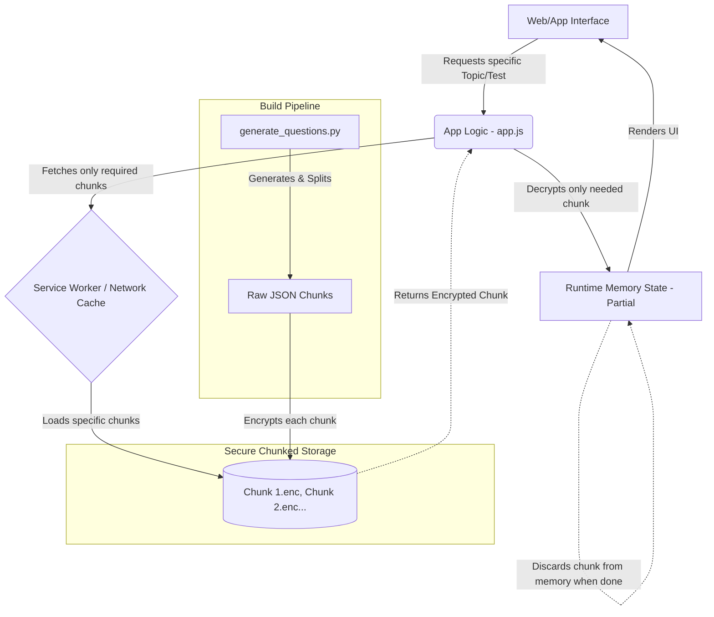

# Life in the UK Test Application - Architecture

This document describes the system architecture and technology landscape for the "Life in the UK" test application.

## Technology Landscape

The project is designed as an offline-first Progressive Web App (PWA) with a Python-based content generation pipeline.

### Frontend
- **HTML/CSS/JS**: Pure Vanilla JavaScript with semantic HTML5 and CSS3 for a lightweight, dependency-free frontend.
- **Progressive Web App (PWA)**: Utilizes a Service Worker (`sw.js`) and Web Manifest (`manifest.json`) for installation and offline capabilities.
- **Client-Side Decryption**: AES decryption implemented natively or via a lightweight library to securely load application data in memory.

### Backend & Data Pipeline
- **Data Generator**: Python script (`generate_questions.py`) that fetches and aggregates questions into a structured database format.
- **Secure Local Storage**: The question database is encrypted during the build step. The raw JSON files are never shipped directly to the client.

## System Architecture

To ensure the integrity and security of the "Life in the UK" questions database, the application employs a **Dynamic Chunked Encryption** architecture. This design guarantees that the database is encrypted at rest and, crucially, that users can **never access or decrypt all questions at the same time**. 

By splitting the question database into small, individually encrypted chunks (e.g., grouped by topic or randomized sets), the client application only ever downloads and decrypts the specific subset of questions required for the immediate session.

### Data Flow & Decryption

The database chunks are fetched dynamically and decrypted securely into memory at runtime. Once a test or flashcard session is complete, the decrypted chunk is cleared from memory.

### Key Security Features
1. **Never Fully Loaded**: It is programmatically impossible for a user to access the entire question bank simultaneously. The frontend only requests the specific encrypted chunk it needs for the current view.
2. **Encrypted at Rest**: The database chunks (`db/chunks/*.enc`) shipped with the application are encrypted. Direct access yields unreadable ciphertext.
3. **In-Memory Volatile Decryption**: Decryption occurs entirely within the application's runtime memory. The decrypted JSON is never saved back to the file system or local storage in plain text, and is aggressively garbage-collected when the session ends.
4. **Protected from Direct Access**: Users inspecting the application network tab or local filesystem will only see individual encrypted blobs, preventing cheating or unauthorized scraping of the question bank.
