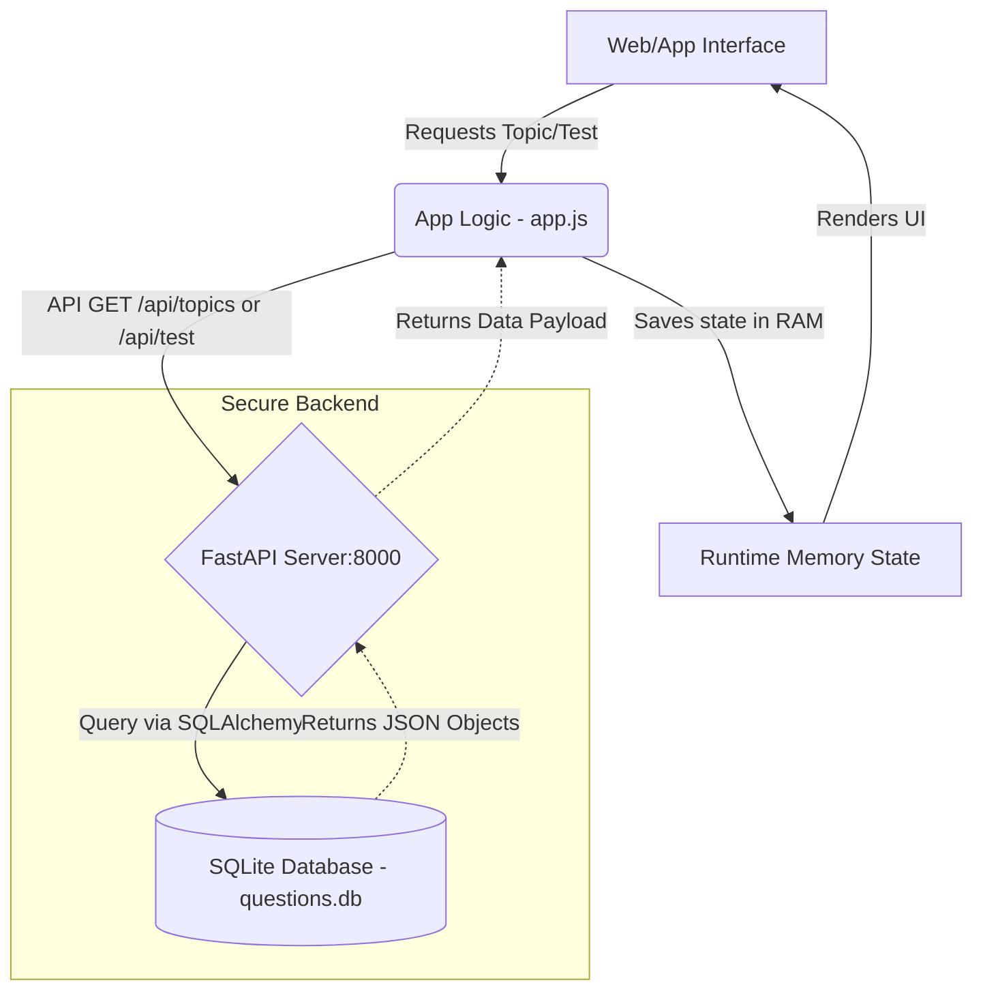

# Life in the UK Test Application - Architecture

This document describes the system architecture and technology landscape for the "Life in the UK" test application.

## Technology Landscape

The project has transitioned from a purely static offline-first application to a robust Client-Server architecture.

### Frontend
- **HTML/CSS/JS**: Pure Vanilla JavaScript with semantic HTML5 and CSS3 for a lightweight, dependency-free frontend.
- **Client-Side Rendering**: The app heavily relies on client-side JS to render flashcards and tests dynamically by fetching data from the backend APIs.

### Backend & Database Server
- **Framework**: Python FastAPI for high-performance and asynchronous REST API handles.
- **Database**: The question bank is securely stored in a local SQLite database (`db/questions.db`).
- **ORM**: SQLAlchemy is used to interact with the SQLite database securely, preventing SQL injection and structuring data easily.
- **Data Security**: The question content is kept proprietary by remaining strictly on the server block. The frontend only requests specific questions needed for the active session via endpoints like `GET /api/topics/{topic_name}`.

### Legacy Data Generation (Offline Pipeline)
- **Data Generator**: A legacy Python script (`generate_questions.py`) was used to fetch, aggregate, and populate the raw JSON data that was eventually migrated to the SQLite database.

## System Architecture

To ensure the integrity and security of the "Life in the UK" questions database, the application employs a **Client-Server Architecture**. This design guarantees that the full proprietary database is never shipped to the end user.

### Data Flow

The frontend fetches data dynamically via REST APIs into memory at runtime.

### Key Security Features
1. **Never Fully Loaded**: It is programmatically impossible for a user to access the entire question bank simultaneously unless they actively scrape the API repeatedly. The frontend only requests the specific questions it needs for the current view.
2. **Server-Side Validation**: Since data is now hosted on a robust API backend, additional authentication or rate-limiting can easily be applied in the future.
3. **Protected from Direct Access**: Users inspecting the application network tab or local filesystem will only see the standard UI code. The database itself (`.db` format) is never exposed to public internet routes.
