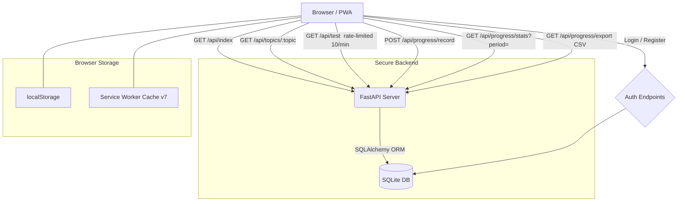

# Life in the UK Test Application — Architecture

This document describes the current system architecture, technology stack, and key design decisions.

---

## Technology Stack

### Frontend
- **Vanilla JS / HTML5 / CSS3** — no frontend framework; lightweight and dependency-free.
- **Chart.js** (CDN) — progress dashboard charts (bar, line, radar).
- **PWA** — `manifest.json` + service worker (`sw.js`) for offline support and installability.

### Backend
- **Python 3.13+** with **FastAPI** — async REST API.
- **SQLAlchemy 2** ORM over **SQLite** (`db/questions.db`).
- **slowapi** — rate limiting on the `/api/test` endpoint.
- **python-multipart** — form data handling support.

### Testing
- **pytest** + **httpx** — backend API integration tests (`tests/test_api.py`).
- **FastAPI TestClient** with in-memory SQLite (`StaticPool`) — no production DB touched.
- Frontend logic tests: `test_runner.html` (shuffleArray, scoring).

### Data Pipeline (optional / dev only)
- `scripts/generate_questions.py` — uses Gemini API + pypdf to generate questions from the study materials PDF. Requires `GEMINI_API_KEY` env var and `--pdf` argument (or `LINUK_PDF_PATH` env var).
- `db/update_sqlite_db.py` — seeds the SQLite DB from a local JSON file.

---

## Application Configuration

Constants are centralised — do not scatter magic numbers in the code:

**`server.py` (top of file):**
```python
TEST_QUESTION_COUNT = 24
TEST_DURATION_MINUTES = 45
TEST_PASS_MARK = 18
STATS_LOOKBACK_DAYS = 30
```

**`js/app.js` (top of file):**
```js
const CONFIG = {
    TEST_QUESTION_COUNT: 24,
    TEST_DURATION_SECONDS: 45 * 60,
    TEST_PASS_MARK: 18,
};
```

---

## Database Schema

Five tables in `db/questions.db`:

### `questions`
| Column | Type | Notes |
|---|---|---|
| id | INTEGER PK | |
| topic | STRING | Indexed (`ix_questions_topic`) |
| question | STRING | |
| options | TEXT | JSON-encoded array of 4 strings |
| correct_answer | STRING | Must match one of `options` |
| explanation | STRING | Optional explanation text |

### `users`
| Column | Type | Notes |
|---|---|---|
| id | INTEGER PK | |
| username | STRING | Unique, indexed |
| pin_hash | STRING | PBKDF2-HMAC-SHA256, 100k iterations |
| salt | STRING | 16-byte hex random salt |
| created_at | DATETIME | |

### `user_sessions`
| Column | Type | Notes |
|---|---|---|
| id | INTEGER PK | |
| user_id | INTEGER FK → users | |
| token | STRING | Unique, URL-safe 32-byte random token, indexed |
| created_at | DATETIME | |
| expires_at | DATETIME | 30-day TTL |

### `test_sessions`
| Column | Type | Notes |
|---|---|---|
| id | INTEGER PK | |
| user_id | INTEGER FK → users | Nullable (guest sessions) |
| timestamp | DATETIME | |
| score | FLOAT | Percentage 0–100 |
| total_questions | INTEGER | |

### `user_responses`
| Column | Type | Notes |
|---|---|---|
| id | INTEGER PK | |
| session_id | INTEGER FK → test_sessions | Nullable |
| user_id | INTEGER FK → users | Nullable (guest) |
| question_id | INTEGER FK → questions | Nullable; used for per-question history |
| topic | STRING | |
| is_correct | BOOLEAN | |
| timestamp | DATETIME | |

---

## System Architecture


```mermaid
graph TD
    A[Browser / PWA] -->|Login / Register| Auth{Auth Endpoints}
    A -->|GET /api/index| B(FastAPI Server)
    A -->|GET /api/topics/:topic| B
    A -->|GET /api/test  rate-limited 10/min| B
    A -->|POST /api/progress/record| B
    A -->|GET /api/progress/stats?period=| B
    A -->|GET /api/progress/export CSV| B

    B -->|SQLAlchemy ORM| D[(SQLite DB)]
    Auth --> D

    subgraph Secure Backend
        B
        D
    end

    subgraph Browser Storage
        LS[localStorage]
        SW[Service Worker Cache v7]
    end

    A --- LS
    A --- SW
```

---

## Authentication

### Design
Lightweight username + 4-digit PIN authentication with server-side sessions.
No OAuth, no email — designed for single-device personal study use.

### Flow
1. User registers with a username + 4-digit numeric PIN.
2. Server hashes PIN with `PBKDF2-HMAC-SHA256` (100,000 iterations, random salt) and stores `User` row.
3. A random `UserSession` token (URL-safe, 32 bytes) is issued and stored in an `HttpOnly` cookie (`session_token`, 30-day TTL).
4. All subsequent requests carry the cookie automatically (same-origin fetch).
5. Progress endpoints filter data by `user_id` from the validated session.
6. Guests can skip login — they get `user_id = None` and see unfiltered aggregate data.

### Endpoints
| Method | Path | Description |
|---|---|---|
| POST | `/api/auth/register` | Register new user, sets session cookie |
| POST | `/api/auth/login` | Login, sets session cookie |
| POST | `/api/auth/logout` | Deletes session from DB + cookie |
| GET | `/api/auth/me` | Returns `{user_id, username}` or 401 |

---

## Flashcard Spaced Repetition

State is persisted in `localStorage` (client-side only, per-device):

### `linuk_learned` — Mark as Learned
```js
// Key: "linuk_learned"
// Value: JSON array of question IDs the user has marked as learned
// e.g. [42, 107, 203]
```
Learned cards are filtered out when starting a flashcard session.
If all cards in a topic are learned, all cards are shown as a fallback.

### `linuk_sr` — Spaced Repetition
```js
// Key: "linuk_sr"
// Value: { [questionId]: { correct: N, incorrect: N, nextReview: ISO_date_or_null } }
```
**Algorithm** (simplified SM-2):
- **Correct**: `nextReview = today + 2^correct days` (exponential back-off: 2, 4, 8, 16… days)
- **Incorrect**: `nextReview = null` (show again immediately)
- **Ordering**: Cards sorted by `incorrect / (correct + incorrect + 1)` — hardest first.
- **Due filter**: Cards with `nextReview` in the future are skipped. If none are due, all cards are shown.

---

## Rate Limiting

`GET /api/test` is limited to **10 requests per minute per IP** using `slowapi`.

```python
@app.get("/api/test")
@limiter.limit("10/minute")
async def get_test(request: Request, limit: int = TEST_QUESTION_COUNT):
```

Returns HTTP 429 when the limit is exceeded.

---

## API Reference

| Method | Path | Auth Required | Description |
|---|---|---|---|
| GET | `/api/index` | No | List all topics with question counts |
| GET | `/api/topics/{topic}?limit=10&offset=0` | No | Paginated questions for a topic |
| GET | `/api/test?limit=24` | No (rate-limited) | Random mock test questions |
| POST | `/api/progress/record` | Optional | Save test results |
| GET | `/api/progress/stats?period=30d\|90d\|all` | Optional | Dashboard statistics |
| GET | `/api/progress/export` | Optional | Download progress as CSV |
| GET | `/api/progress/questions?limit=50` | Optional | Per-question history |
| POST | `/api/auth/register` | No | Register new user |
| POST | `/api/auth/login` | No | Login |
| POST | `/api/auth/logout` | No | Logout |
| GET | `/api/auth/me` | Yes | Get current user info |

---

## Running the Application

```bash
# Install dependencies
pip install -r requirements.txt

# Start the server (from the linuk-tester directory)
uvicorn server:app --reload --port 8000

# Open browser
http://localhost:8000
```

## Running Tests

```bash
# From the linuk-tester directory
pytest tests/ -v
```

Tests use an in-memory SQLite database — safe to run at any time, no production data is affected.

## Generating Questions (Dev Only)

```bash
python scripts/generate_questions.py --pdf "path/to/study-materials.pdf"
# Or via env var:
# LINUK_PDF_PATH="path/to/study-materials.pdf" python scripts/generate_questions.py
```

Requires `GEMINI_API_KEY` in a `.env` file or environment.

---

## PWA / Offline Support

- Service worker: `sw.js` (cache version `linuk-cache-v7`)
- Caches: `index.html`, `css/style.css`, `js/app.js`
- Strategy: **network-first** with cache fallback
- Icons: `assets/icon-192.png`, `assets/icon-512.png` (192×192 and 512×512 PNG)
